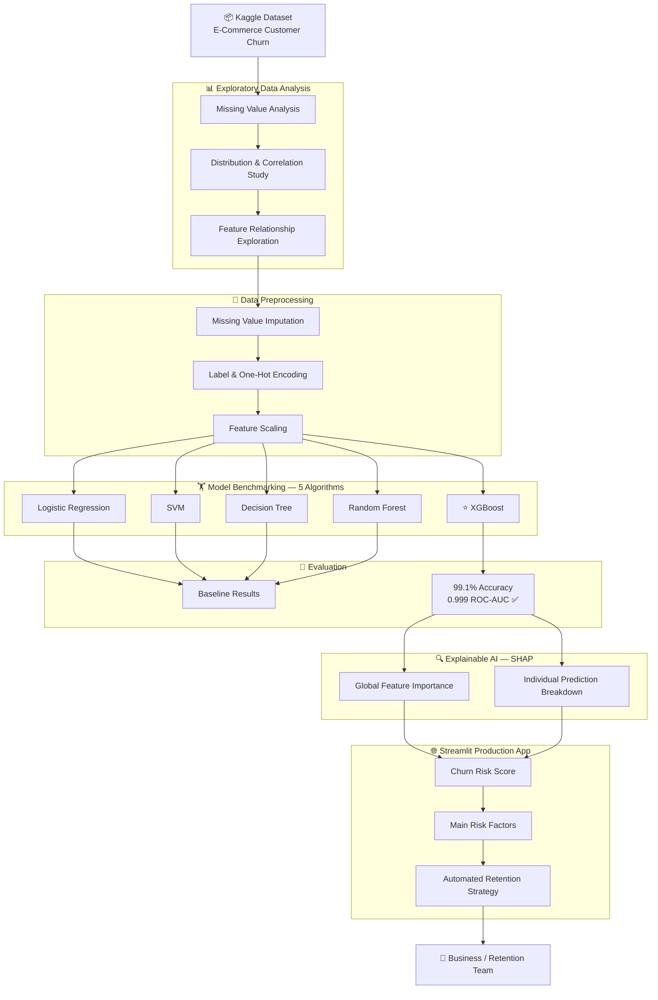
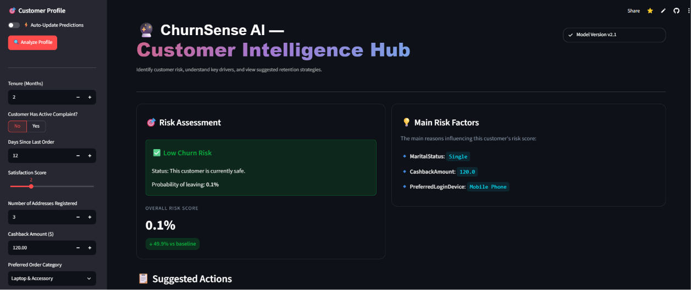
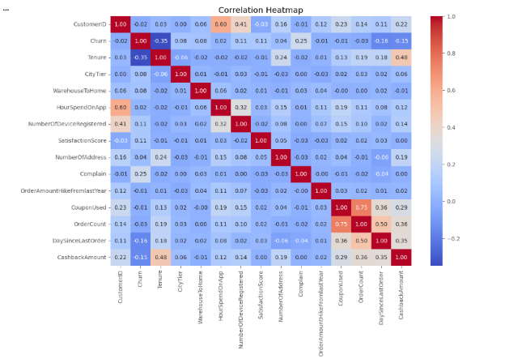
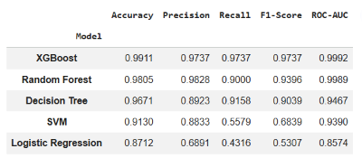

<div align="center">

# 🎯 ChurnSense AI
## Explainable E-Commerce Customer Churn Predictor

*From raw data to production-ready AI — with full transparency on every prediction.*

[](https://churnsense-ai-app.streamlit.app/#risk-assessment)
[](https://github.com/mshakeelrasheed/churnsense-ai)
[](https://python.org)
[](https://xgboost.readthedocs.io)
[](https://shap.readthedocs.io)
[](LICENSE)

</div>

---

## 📋 Table of Contents

- [Overview](#-overview)
- [Live Demo](#-live-demo)
- [Key Features](#-key-features)
- [Architecture & Workflow](#-architecture--workflow)
- [Screenshots](#-screenshots)
- [Model Performance](#-model-performance)
- [Tech Stack](#-tech-stack)
- [Project Structure](#-project-structure)
- [Installation & Setup](#-installation--setup)
- [Usage Guide](#-usage-guide)
- [Dataset](#-dataset)
- [Acknowledgments](#-acknowledgments)
- [License](#-license)

---

## 🧠 Overview

**ChurnSense AI** is a production-ready, end-to-end machine learning application that predicts customer churn in e-commerce — and more importantly, *explains why* a customer is at risk.

Most churn models stop at a probability score. ChurnSense AI goes further: using **SHAP (Shapley Additive Explanations)**, it breaks down every prediction into individual risk factors, giving retention teams the clarity to act with precision rather than guessing.

> **The core insight:** Predicting churn is only half the battle. Understanding the *reasons* behind it — and mapping those reasons to concrete retention strategies — is where real business value is created.

**What makes this project different:**
- Not just a notebook — a fully deployed, interactive web application
- Not just a prediction — an *explanation* for every output
- Not just a risk score — actionable retention strategies mapped to each risk level

---

## 🚀 Live Demo

🔗 **[Try ChurnSense AI Live →](https://churnsense-ai-app.streamlit.app/#risk-assessment)**

Enter a customer profile, get an instant churn risk score, understand the key risk drivers, and view recommended retention actions — all in real time.

---

## ✨ Key Features

- **🏆 Rigorous Model Benchmarking** — Evaluated 5 ML algorithms (Logistic Regression, SVM, Decision Tree, Random Forest, XGBoost) before selecting the best performer based on Accuracy, Precision, Recall, F1-Score, and ROC-AUC
- **📈 High-Performance Model** — Final XGBoost classifier achieves **99.1% Accuracy** and **0.999 ROC-AUC** on a clean, well-structured e-commerce dataset
- **🔍 Explainable AI (XAI)** — SHAP integration provides per-prediction feature importance, moving away from black-box outputs toward transparent, interpretable AI
- **🎯 Actionable Retention Strategies** — Dashboard maps churn risk levels to specific, automated business actions rather than raw percentages
- **⚡ Real-Time Inference** — Interactive Streamlit UI delivers instant predictions with sub-second response times
- **🏗️ Production Architecture** — Clean separation of preprocessing, modeling, explainability, and UI layers

---

## 🏗️ Architecture & Workflow



---

## 🖼️ Screenshots

**Live Dashboard — Customer Intelligence Hub**


---

**Exploratory Data Analysis — Correlation Heatmap**


---

**Model Benchmarking — Performance Comparison**


---

## 📊 Model Performance

Five classification algorithms were benchmarked under identical conditions. Results on the test set:

| Model | Accuracy | Precision | Recall | F1-Score | ROC-AUC |
|---|---|---|---|---|---|
| **XGBoost ⭐** | **0.9911** | **0.9737** | **0.9737** | **0.9737** | **0.9992** |
| Random Forest | 0.9805 | 0.9828 | 0.9000 | 0.9396 | 0.9989 |
| Decision Tree | 0.9671 | 0.8923 | 0.9158 | 0.9039 | 0.9467 |
| SVM | 0.9130 | 0.8833 | 0.5579 | 0.6839 | 0.9390 |
| Logistic Regression | 0.8712 | 0.6891 | 0.4316 | 0.5307 | 0.8574 |

> XGBoost was selected as the production model based on its consistent dominance across all five evaluation metrics — particularly its near-perfect ROC-AUC of **0.9992**.

---

## 🛠️ Tech Stack

| Layer | Tools & Libraries |
|---|---|
| **Language** | Python 3.9+ |
| **ML & Modeling** | XGBoost · Scikit-learn · Pandas · NumPy |
| **Explainability** | SHAP (Shapley Additive Explanations) |
| **Frontend / UI** | Streamlit |
| **Serialization** | Pickle (model, encoders, scaler) |
| **Version Control** | Git · GitHub |
| **Deployment** | Streamlit Cloud |

---

## 📁 Project Structure

```
churnsense-ai/
│
├── notebooks/
│   ├── 01_eda.ipynb                  # Exploratory Data Analysis
│   ├── 02_preprocessing.ipynb        # Data cleaning & encoding
│   ├── 03_modeling.ipynb             # Model training & benchmarking
│   ├── 04_evaluation.ipynb           # Performance evaluation
│   └── 05_explainable_ai.ipynb       # SHAP integration & analysis
│
├── screenshots/                      # Project visuals for README
│   ├── dashboard.png
│   ├── correlation_heatmap.png
│   ├── model_comparison.png
│   └── ...
│
├── app.py                            # Main Streamlit application
├── encoders.pkl                      # Saved label encoders
├── scaler.pkl                        # Saved feature scaler
├── xgboost_model.pkl                 # Trained XGBoost model
├── requirements.txt                  # Python dependencies
├── LICENSE
└── README.md
```

---

## ⚙️ Installation & Setup

**1. Clone the repository**
```bash
git clone https://github.com/mshakeelrasheed/churnsense-ai.git
cd churnsense-ai
```

**2. Install dependencies**
```bash
pip install -r requirements.txt
```

**3. Run the application locally**
```bash
streamlit run app.py
```

The app will launch at `http://localhost:8501`

---

## 📖 Usage Guide

1. Open the [live app](https://churnsense-ai-app.streamlit.app/#risk-assessment) or run locally
2. Fill in the **Customer Profile** panel on the left sidebar:
   - Tenure, Satisfaction Score, Days Since Last Order
   - Complaint status, Cashback Amount, Number of Addresses, Preferred Order Category
3. Click **Analyze Profile**
4. View the output:
   - **Risk Assessment** — churn probability and risk level (Low / Medium / High)
   - **Main Risk Factors** — SHAP-driven breakdown of which features are driving the score
   - **Suggested Actions** — automated retention strategies mapped to the customer's risk profile

---

## 📂 Dataset

- **Source:** Kaggle — E-Commerce Customer Churn Dataset
- **Link:** [E-Commerce Customer Churn Dataset](https://www.kaggle.com/datasets/ankitverma2010/ecommerce-customer-churn-analysis-and-prediction)
- **Features:** 20 customer attributes including tenure, satisfaction score, complaint history, order behavior, payment preferences, and cashback amount
- **Target Variable:** `Churn` (Binary: 0 = Retained, 1 = Churned)

---

## 🙏 Acknowledgments

This project was developed as part of my AI engineering learning journey. I'd like to thank **Corvit Institute Bahawalpur** for providing the practical foundation in machine learning and deep learning that made building a project of this scope possible.

---

## 📄 License

This project is licensed under the **MIT License** — see the [LICENSE](LICENSE) file for details.

---

<div align="center">

**Built with 🤖 machine learning and 🔍 explainability in mind**

If you found this project useful, please consider giving it a ⭐

---

**M. Shakeel Rasheed**
*AI Engineer · Machine Learning · NLP · Agentic AI*

[](https://www.linkedin.com/in/mshakeelrasheed)
[](https://github.com/mshakeelrasheed)
[](https://huggingface.co/mshakeelrasheed)

</div>
